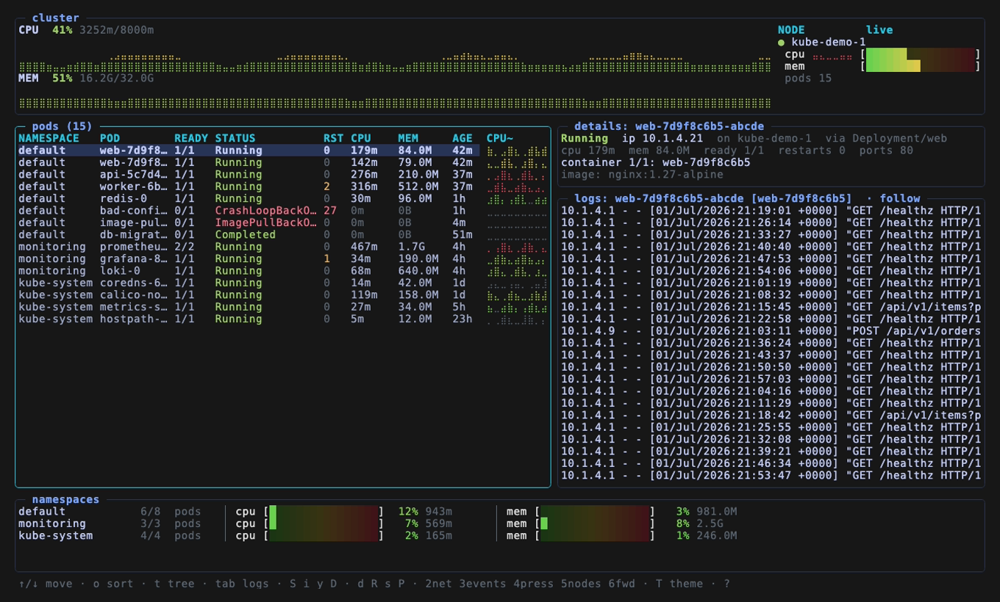

# kubeview

A btop-style terminal dashboard for monitoring a Kubernetes (microk8s) cluster.
A multi-pane live view: cluster CPU/MEM history (braille graphs), every pod
across all namespaces with per-pod CPU sparklines, a container-detail pane, an
auto-tailed logs pane for the selected pod, and per-namespace resource meters.




> Try it without a cluster: `kubeview --demo` renders a synthetic cluster (the
> data used for the screenshot and animation above).

## Install

kubeview is a single static binary (no runtime deps). Pick one:

**Release binary (installer):** run on the target machine:

```sh
curl -fsSL https://raw.githubusercontent.com/tpenzkofer/kubeview/main/install.sh | bash
# or a specific version:  ... | bash -s -- v0.1.0
```

**Debian / Ubuntu (`.deb`):** tracked by `dpkg`, so `apt remove kubeview` cleans up.

```sh
arch=$(dpkg --print-architecture)                     # amd64 or arm64
tag=$(curl -fsSL https://api.github.com/repos/tpenzkofer/kubeview/releases/latest \
      | grep -m1 '"tag_name"' | cut -d'"' -f4)
deb="kubeview_${tag#v}_linux_${arch}.deb"
curl -fsSLO "https://github.com/tpenzkofer/kubeview/releases/download/${tag}/${deb}"
sudo apt install "./${deb}"
```

An `.rpm` with the same name scheme is published for Fedora/RHEL.

**With Go (≥ the version in `go.mod`):**

```sh
go install github.com/tpenzkofer/kubeview@latest
```

**From source:**

```sh
git clone https://github.com/tpenzkofer/kubeview && cd kubeview
make build          # ./kubeview for this host
make dist           # cross-compiled binaries in dist/ (linux/darwin × amd64/arm64)
```

### Prerequisites

A reachable kubeconfig (or in-cluster service account). On a microk8s node:

```sh
microk8s config > ~/.kube/config
microk8s enable metrics-server   # needed for the CPU/MEM meters
```

## Deploy on a server

kubeview is an interactive TUI, so you run it on a machine and view it in a
terminal — it is not a background daemon. Two common setups:

- **On the cluster node:** install the binary (above) and run it over SSH.
  It uses the node's `~/.kube/config` (and `microk8s kubectl` for shell /
  port-forward). This is the simplest option.
- **From your workstation:** point it at the cluster with an exported
  kubeconfig — `scp node:~/.kube/config ./kc && kubeview -kubeconfig ./kc`
  (edit the `server:` field to the node's reachable IP). Interactive shell and
  port-forward assume `microk8s kubectl` on the host, so those two features work
  best when run on the node itself.

Cross-compile for the server's arch and copy the binary directly:

```sh
make dist && scp dist/kubeview-linux-arm64 user@server:/usr/local/bin/kubeview
```

Releases (cross-compiled tarballs + checksums) are produced automatically by
GitHub Actions when you push a `vX.Y.Z` tag (`git tag v0.1.0 && git push --tags`).

## Run

```sh
./kubeview                  # interactive btop-style TUI (all namespaces)
./kubeview --demo           # synthetic cluster, no kubeconfig needed
./kubeview -theme gruvbox   # tokyonight|gruvbox|nord|dracula|mono
./kubeview -namespace demo  # single namespace
./kubeview -interval 1s     # refresh rate
./kubeview --snapshot       # print one plain-text frame and exit (scriptable)
./kubeview --dump-frame 140x40                 # render one TUI frame to stdout (for testing)
./kubeview --dump-frame 140x40 --frame-mode net   # modes: list|net|logs|help|modal
```

### Keys

**Global**

| key | action |
|-----|--------|
| `1`…`6` | dashboard / network / events / pressure / nodes / port-forwards |
| `T` | cycle colour theme (saved) |
| `?` | help + plain-language explanations of k8s concepts |
| `r` | refresh now |
| `tab` | switch focus between the pods list and the logs pane |
| `q` | quit (saves preferences) |

**Pods list (focused)**

| key | action |
|-----|--------|
| `↑`/`↓` `PgUp`/`PgDn` `g`/`G` | move selection |
| `o` | cycle sort: name → cpu → mem → restarts → age → status |
| `t` | toggle tree view (group pods under their Deployment/DaemonSet/…) |
| `space` | fold/unfold the selected group (tree view) |
| `/` | filter by namespace/pod name |
| `S` | open an interactive shell inside the selected container (`exec -it`) |
| `i` | inspect: env, mounts, `df`, processes, `ls /` (read-only) |
| `y` | view live YAML |
| `D` | describe + recent events |
| `d` | delete pod (confirm) |
| `R` | restart workload — rollout restart for Deployments (confirm) |
| `s` | scale the Deployment behind the pod |
| `P` | port-forward the pod to this host |

**Logs pane (focused via `tab`)**

| key | action |
|-----|--------|
| `↑`/`↓` `PgUp`/`PgDn` `g`/`G` | scroll |
| `f` | toggle follow-tail |
| `w` | toggle line wrap |
| `p` | toggle previous-container logs (why a `CrashLoopBackOff` died) |
| `[` / `]` | switch container in a multi-container pod |
| `/` | search within the log |

Destructive/outward actions (`d`, `R`, `s`, `P`) always ask for confirmation first.
The interactive shell and port-forward use the node's `microk8s kubectl`. `P` starts a
**background** port-forward (binds `0.0.0.0` on the host); manage them in the `6` view
(`x` stop selected, `X` stop all).

**Views:** `5` shows per-node capacity/allocatable/requests/usage with pressure
conditions and pod-slot saturation; `4` ranks pods by memory headroom and flags
unbounded/under-requested/near-OOM pods.

**Preferences** (theme, sort, tree, namespace, interval) are saved on quit to
`$XDG_CONFIG_HOME/kubeview/config.json` and restored next launch; explicit flags override them.

## Flags

| flag | default | meaning |
|------|---------|---------|
| `-kubeconfig` | `$KUBECONFIG` or `~/.kube/config` | kubeconfig path |
| `-namespace` | all | limit to one namespace |
| `-interval` | `2s` | refresh interval |
| `-truecolor` | `true` | force 24-bit colour (btop-style gradients) |
| `-theme` | `tokyonight` | colour theme: `tokyonight`/`gruvbox`/`nord`/`dracula`/`mono` |
| `--snapshot` | off | print one frame and exit |

## Notes

- Without `metrics-server`, the app still runs; CPU/MEM columns show `0` and the
  header shows `[metrics-server off]`.
- Status column mirrors `kubectl get pods` (CrashLoopBackOff, Init:0/1,
  ContainerCreating, Completed, Error, Terminating, …) and is colour-coded.
